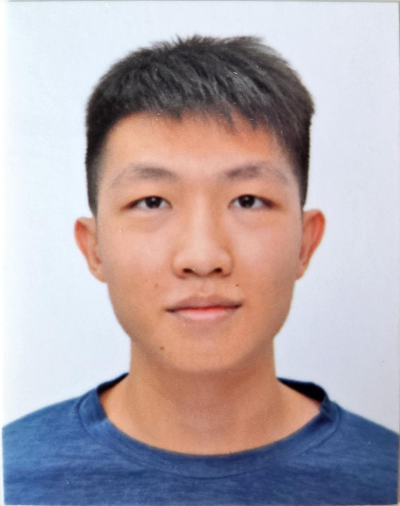
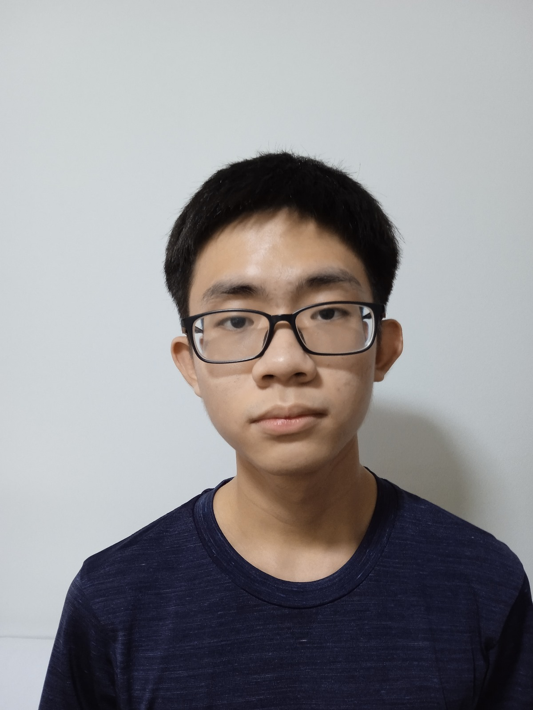

We are a team based in the [School of Computing, National University of Singapore](https://www.comp.nus.edu.sg).

You can reach us at the email `seer[at]comp.nus.edu.sg`

## Project team

### Jia Hao

[[github](https://github.com/yjiahao)]
[[portfolio](team/johndoe.md)]

* Role: Scheduling and tracking, Documentation
* Responsibilities: Responsible for the quality of various project documents, and defining, assigning, and tracking project tasks.

### Jane Doe

[[github](http://github.com/johndoe)]
[[portfolio](team/johndoe.md)]

* Role: Team Lead
* Responsibilities: UI

### Johnny Doe

[[github](http://github.com/johndoe)] [[portfolio](team/johndoe.md)]

* Role: Developer
* Responsibilities: Data

### Chia Bing Xuan

[[github](http://github.com/chiabingxuan)]
[[portfolio](team/johndoe.md)]

* Role: Integration and Code Quality
* Responsibilities: To facilitate the combination of various features, ensuring that they function together as an entire product. To also make sure that the codebase abides by the coding standard enforced.

### James Doe

[[github](http://github.com/johndoe)]
[[portfolio](team/johndoe.md)]

* Role: Developer
* Responsibilities: UI
