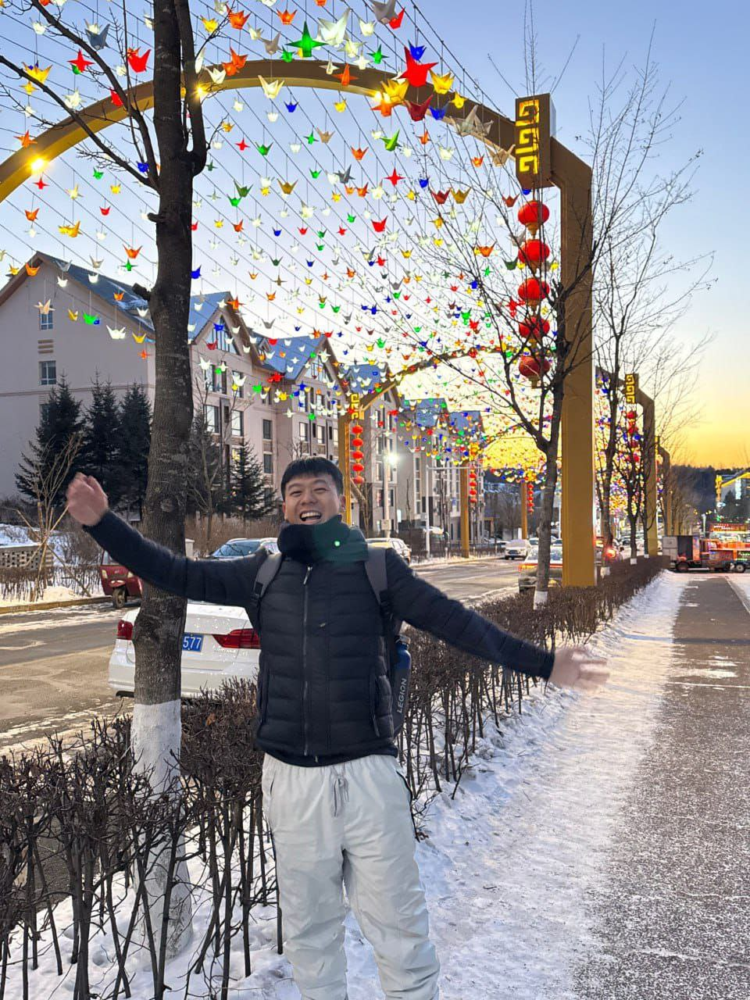
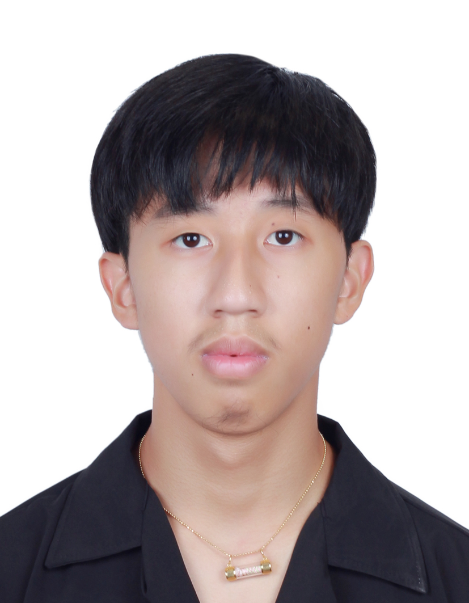
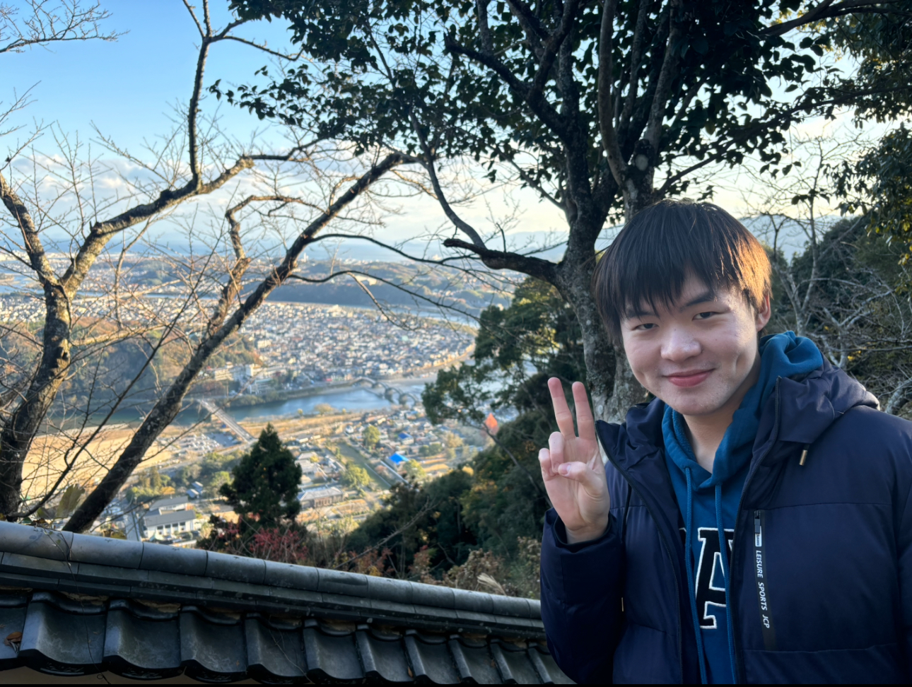

We are a team based in the [School of Computing, National University of Singapore](https://www.comp.nus.edu.sg).

You can reach us at the email `e0970391@u.nus.edu`

## Project team

### Jia Hao

[[github](https://github.com/yjiahao)]
[[portfolio](team/yjiahao.md)]

* Role: Scheduling and tracking, Documentation
* Responsibilities: Responsible for the quality of various project documents, and defining, assigning, and tracking project tasks.

### Lim Yi Fei

[[github](http://github.com/limyifei)] 
[[portfolio](team/limyifei1513.md)]

* Role: Deliverables and deadlines
* Responsibilities: Ensure project deliverables are done on time and in the right format.

### Chia Bing Xuan

[[github](http://github.com/chiabingxuan)]
[[portfolio](team/chiabingxuan.md)]

* Role: Integration and Code Quality
* Responsibilities: To facilitate the combination of various features, ensuring that they function together as an entire product. To also make sure that the codebase abides by the coding standard enforced.

### Supanutt Maleemongkol

[[github](http://github.com/microaugust)]
[[portfolio](team/microaugust.md)]

* Role: Feature Developer
* Responsibilities: Responsible for designing and implementing new features and coordinate with tester to ensure features are fully functional and error-free.

### Basil Kuok

[[github](https://github.com/basilkuok)]
[[portfolio](team/basilkuok.md)]

* Role: Testing
* Responsibilities: Ensures the testing of the project is done properly and on time
